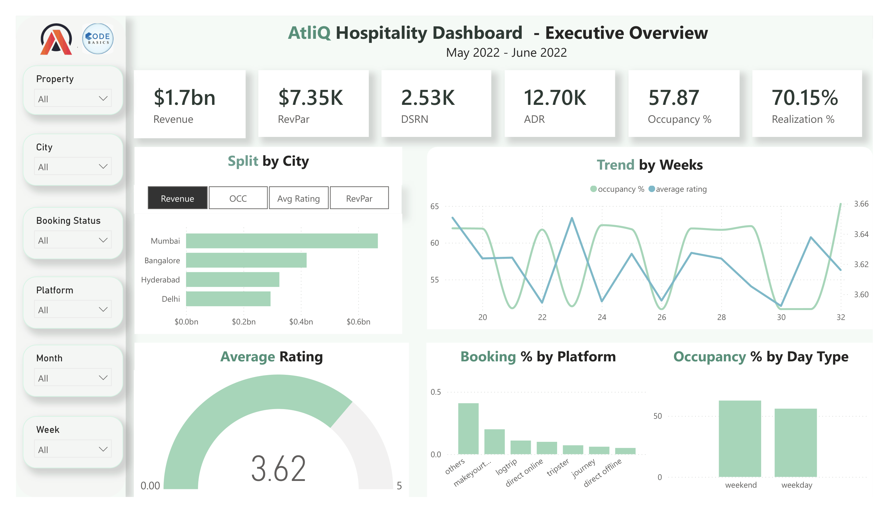
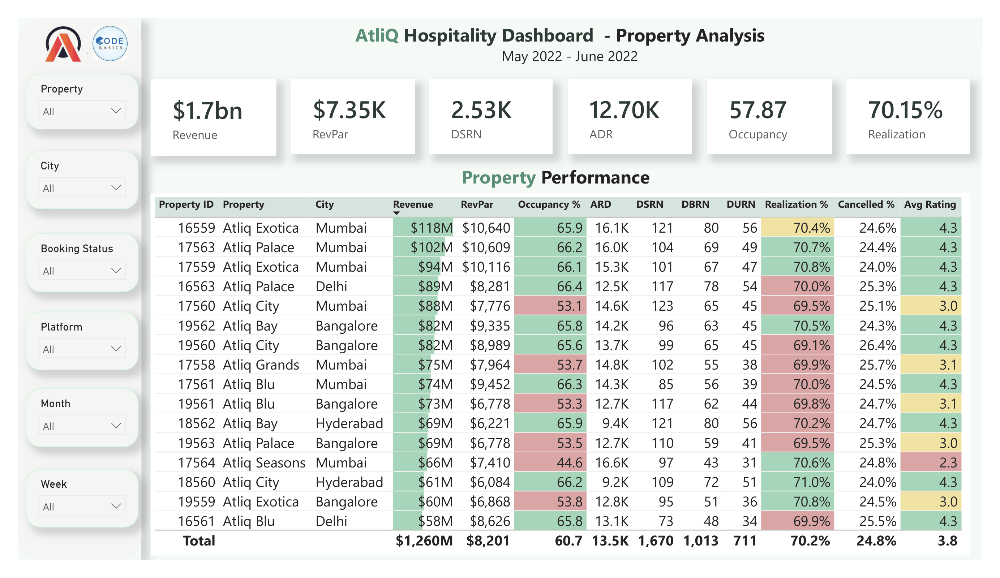

# AtliQ Hospitality Power BI Dashboard

## Overview

This project presents an interactive Power BI dashboard designed to analyze the operational performance of AtliQ Hospitality across multiple cities and properties. The dashboard transforms raw booking data into actionable insights, enabling stakeholders to monitor business performance and support data-driven decision-making.

**Analysis Period:** May 2022 – June 2022

---

## Dashboard Preview

### Executive Overview



### Property Analysis



---

## Dashboard Demo

### Executive Overview

https://github.com/user-attachments/assets/87f2bdd2-8568-40aa-b1dc-f6b166ba3f19

### Property Analysis

https://github.com/user-attachments/assets/071027a3-3dec-4a7e-b426-901486401e00

---

## Business Objectives

- Monitor overall hotel performance through key business KPIs.
- Compare revenue and occupancy across cities and properties.
- Analyze booking trends and platform performance.
- Track customer ratings and booking realization.
- Support data-driven decision-making.

---

## Key Performance Indicators

| KPI | Description |
|------|-------------|
| Revenue | Total revenue generated |
| RevPAR | Revenue per Available Room |
| ADR | Average Daily Rate |
| Occupancy % | Percentage of occupied rooms |
| Realization % | Successfully realized bookings |
| DSRN | Daily Sellable Room Nights |
| DBRN | Daily Booked Room Nights |
| DURN | Daily Utilized Room Nights |
| Average Rating | Average customer satisfaction score |

---

## Dashboard Features

### Executive Overview

- Executive KPI summary
- Revenue analysis by city
- Weekly occupancy trends
- Booking platform contribution
- Occupancy analysis by day type
- Dynamic comparison of cities using Revenue, Occupancy, Average Rating, and RevPAR
- Interactive slicers for property, city, booking status, platform, month, and week

### Property Analysis

- Property-level performance comparison
- Revenue and RevPAR analysis
- Occupancy and ADR comparison
- Realization and cancellation analysis
- Average customer rating analysis
- Conditional formatting for performance evaluation

---

## Key Insights

- Mumbai generated the highest overall revenue among all cities.
- Occupancy remained consistently above 50%, with noticeable differences across properties.
- Average customer ratings were relatively consistent across cities, indicating a stable guest experience.
- RevPAR varied significantly between properties, highlighting differences in pricing and occupancy efficiency.
- Weekend occupancy outperformed weekday occupancy, suggesting stronger leisure travel demand.
- Online booking platforms contributed the majority of reservations, while direct offline bookings had the smallest share.
- Several properties recorded cancellation rates above 24%, presenting opportunities to improve booking realization and reduce revenue loss.

---

## Tools & Technologies

- Power BI
- Power Query
- DAX
- Microsoft Excel
- CSV

---

## Skills Demonstrated

- Data Cleaning
- Data Transformation
- Data Modeling
- DAX Measures
- Dashboard Design
- Business Intelligence
- KPI Development
- Data Visualization
- Analytical Reporting

---

## Repository Structure

```text
AtliQ-Hospitality-PowerBI-Dashboard
│
├── Dashboard/
│   └── AtliQ Hospitality Dashboard.pbix
│
├── Dataset/
│   ├── dim_date.csv
│   ├── dim_hotels.csv
│   ├── dim_rooms.csv
│   ├── fact_aggregated_bookings.csv
│   └── fact_bookings.csv
│
├── Images/
│   ├── executive-overview.png
│   └── property-analysis.png
│
├── Videos/
│   ├── executive-overview-demo.mp4
│   └── property-analysis-demo.mp4
│
└── README.md
```

---

## Acknowledgements

This project was developed using the AtliQ Hospitality dataset provided by Codebasics as part of the Power BI Resume Project Challenge.

---

## Author

**Pulkit Bhardwaj**

- GitHub: https://github.com/PulkitBhardwaj20
- LinkedIn: www.linkedin.com/in/pulkit-b-095377217
